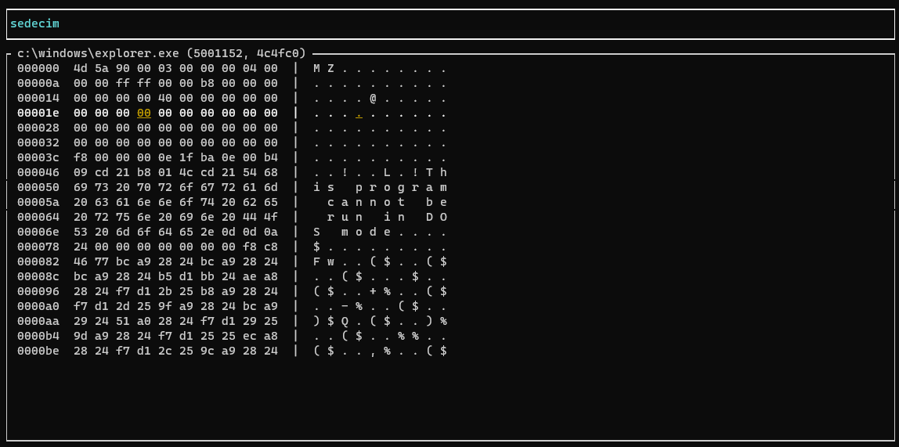

# sedecim
CLI Hex Reader in Rust

## Commands to Run
* git clone https://github.com/CodeOnARaft/sedecim.git
* cd sedecim
* cargo run *filename*

## Controls

|Key |Use  |
--- | --- |
| Arrow Keys | Move Cursor |
| Page Up/Page Down | Move Up/Move Down Page |
| q | Quit/Exit |
| ctrl+g | Jump to address |
| h | Help |

### TODO
* Make this a hex editor and not just a reader